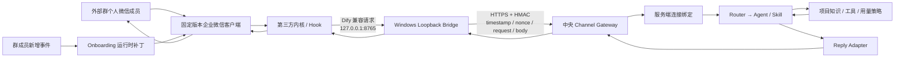
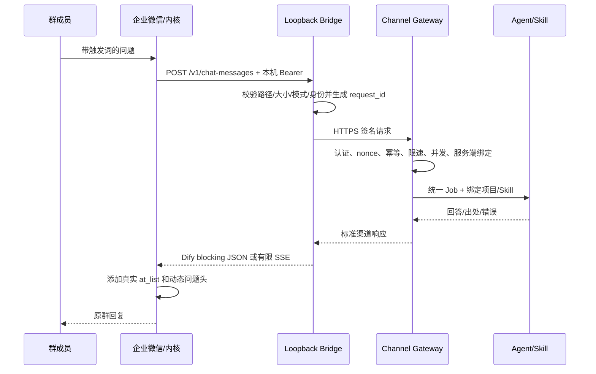
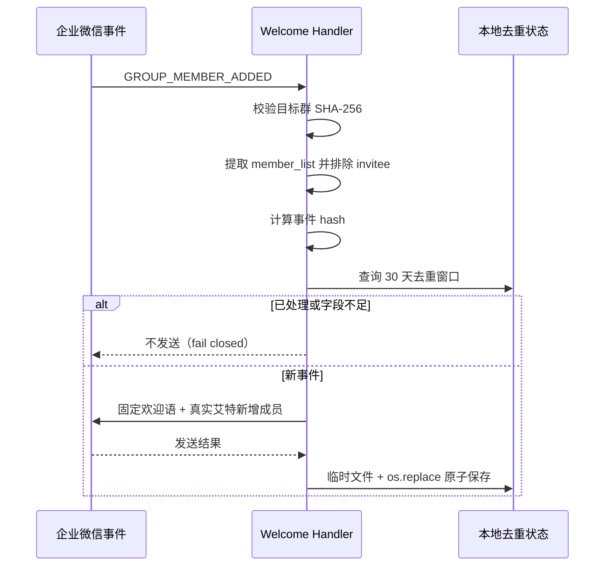

# 企业级 IM Agent 渠道项目：开发复盘与交接文档

> 文档版本：v1.0
> 证据快照：2026-08-24（Asia/Shanghai）
> 项目阶段：受控测试 / 实验性渠道，非官方企业微信机器人，未达到生产化验收
> 适用读者：原开发者、接手开发者、后端/Agent 面试复盘
> 文档原则：只记录能由代码、测试、运行状态或历史验收证据支持的事实；不记录密钥、原始群/成员 ID、聊天正文、客户资料或内部服务地址。

---

## 0. 如何使用这份文档

这份文档同时承担三个用途：

1. **离职交接**：接手人能知道系统解决什么问题、由哪些模块组成、如何验证、哪里存在风险。
2. **个人复盘**：半年或一年后仍能还原需求演进、架构取舍、主要故障和没有完成的部分。
3. **面试准备**：把项目从“调用了一个大模型 API”提升为“受约束的 Agent 渠道接入与后端可靠性工程”来讲述。

使用时必须保留以下事实边界：

- 这是企业微信**外部客户群**的实验性 AI 问答渠道。
- 企业微信消息收发依赖第三方未签名客户端内核及 Hook/注入路径，**不是企业微信官方机器人 API**。
- 已完成过真实测试群闭环，但没有完成生产规模、长期稳定性、跨客户权限隔离和合规上线验收。
- “原生引用回复”只完成了结构恢复、沙箱预览和部分调用链验证，没有形成稳定的主动发送闭环。
- 2026-08-21 曾验证正式测试链路健康；2026-08-24 当前只读快照已经退化，不能把旧健康记录当作当前可用性证明。

---

## 1. 项目摘要

### 1.1 一句话定义

构建一条从企业微信外部客户群进入公司 Agent/知识库能力的受控消息渠道：识别指定触发词，将群消息经过本机安全桥接和中央网关路由到绑定的项目与 Skill，再把答案带真实艾特返回原群；同时补充新人入群欢迎、答案展示、去重、健康检查、失败关闭与脱敏审计。

### 1.2 业务问题

外部客户群中的个人微信成员希望直接在原群提问，并获得基于公司知识资料的 AI 回答。业务真正需要的不是关键词固定回复，而是：

- 自然语言问题理解；
- 知识库检索与有依据回答；
- 没有依据时拒答或转人工；
- 原群回复并真实艾特提问人；
- 后续可绑定不同项目、Skill、知识范围和用量策略；
- 不同群、成员、会话之间不能串话；
- 能诊断“消息没进来、Agent 没执行、回答没发回去”分别卡在哪一层。

### 1.3 核心约束

官方能力调研后确认：普通外部群机器人和企微智能机器人不能直接满足“外部客户群内自定义 RAG/Agent 自动问答”的目标。项目因此采用非官方客户端内核进行消息收发，但把不可信、强版本耦合的客户端侧能力限制在最小边界内，将身份绑定、项目路由、Agent/Skill 执行、幂等和治理尽量放在可维护的后端。

### 1.4 项目价值

项目的主要工程价值不是“把消息转给 Dify”，而是完成了以下拆分：

- 将**渠道接入**与**Agent 业务执行**解耦；
- 将客户端可提交的原始字段与服务端可信的 tenant/project/Skill 绑定分离；
- 对身份、重放、幂等、限速、并发、超时、断路、日志和密钥建立明确边界；
- 将 Windows 桌面程序改造成可启动、可检查、可回滚、可失败关闭的受控节点；
- 对封闭内核进行最小侵入的运行时补丁，补齐群问答展示和新人欢迎业务。

---

## 2. 范围、状态与真实性边界

### 2.1 功能状态矩阵

| 能力 | 状态 | 已有证据 | 尚缺什么 |
|---|---|---|---|
| 外部群问题 → Dify RAG → 原群回复 | 已验证测试闭环 | 2026-08-13 真实测试群可见回复、适配器健康、Dify HTTP 200 | 长期稳定性、跨成员/跨群隔离全矩阵、生产审批 |
| 外部群问题 → 本机 Bridge → 中央 Agent/Skill → 原群回复 | 曾验证测试闭环 | 2026-08-21 受控重启后任务、8765/8002、Bridge 模式和心跳均健康 | 2026-08-24 已退化；需恢复后重新做真实 E2E |
| 真实艾特提问人 | 已完成 | 原发送接口 `at_list` 路径与单测/群内表现 | 客户端升级后需回归 |
| 动态复述原问题 + 分隔线 + 完整回答 | 已完成 | 公开脱敏包 14 项 onboarding/格式测试通过；2026-08-21 运行验证 | 当前运行态失效后需重新 E2E |
| 并发问题上下文隔离 | 代码与单测完成 | `ContextVar` 并发测试通过 | 生产并发和长耗时压测 |
| 新人入群欢迎并艾特新人 | 代码与单测完成，曾部署 | 群白名单、事件去重、8 个逻辑测试包含配置检查 | 当前运行态需恢复；真实大规模入群事件未压测 |
| 回答净化（去思考链、HTML 注释、Markdown 痕迹） | 本地代码与单测完成 | 3 项 JSON/SSE 净化测试通过 | 本地发布副本尚有未提交变更；远端 `main` 不应默认视为已包含此补丁 |
| 原生引用回复 | 未完成，已暂停 | 静态结构、沙箱引用预览、UI 线程/消息对象调用证据 | 稳定发送闭环、正确目标映射、客户端生命周期稳定性 |
| 500 人群生产承载 | 未验证 | 只有风险分析和生产门禁清单 | 压测、队列、全局限速、降级、监控、合规审批 |
| 官方 API 合规生产方案 | 不在当前实现内 | 官方能力边界已调研 | 若生产必须切换官方客服/其他官方渠道或取得正式授权 |

### 2.2 不应在交接或简历中写成已完成的内容

- 不要写“企业微信官方机器人”。
- 不要写“已生产上线”或“稳定服务 500 人群”。
- 不要写“实现企业微信原生引用回复”。
- 不要写“解决了 54 秒延迟”；该延迟只是被定位为上游 Agent/模型耗时，尚未优化完成。
- 不要把一次 HTTP 200、端口监听或进程存在描述成完整可用。
- 不要把代码单测通过描述成真实群端到端通过。
- 不要宣称独立开发了第三方 `newqi24.exe`、企微 Hook DLL 或 Dify 平台本身。

---

## 3. 需求演进与开发时间线

### 3.1 阶段 A：验证最小 RAG 闭环（2026-08-13）

初始目标是让外部群成员用自然语言查询公司知识库。经过官方能力边界调研后，使用固定企业微信版本、第三方客户端内核、本机 Dify 适配层和 Dify Cloud Chat/RAG 搭建最小闭环。

主要输出：

- 固定企业微信 `4.1.33.6009` 与第三方内核版本；
- `adapter/dify_proxy.py` 只监听 `127.0.0.1:8765`；
- 只允许有限 Dify API 路径并透传 Bearer；
- 测试触发词、测试群、虚构知识库和测试问题清单；
- 真实测试群中完成“提问 → 检索 → 回答 → 原群发送”；
- 明确 `/all-groups` 失败不等同于消息闭环失败。

### 3.2 阶段 B：安全打包与可复现发布（2026-08-13 至 2026-08-17）

原始工作区包含二进制、日志、数据库、图片、聊天 CSV 和 `.env`，不能直接作为代码仓库发布。项目建立独立发布目录 `zhixing-publish`，只复制可公开、可复现、可脱敏的部分。

主要输出：

- `.env.example` 与 Dify 配置说明；
- 内核下载、解压和双层 SHA-256 校验；
- 企业微信版本门禁与签名说明；
- Windows 防火墙、启动、停止、状态和发布验证脚本；
- 安全与第三方组件说明；
- 禁止提交 `.env`、二进制、日志、数据库、CSV、JSONL、图片和密钥的扫描；
- 公开仓库 `main` 的当前远端提交经 2026-08-24 只读查询仍为 `c3a911bf974d925ada44e6aac95c486e538c847d`。

### 3.3 阶段 C：从 Dify 直连升级为中央 Agent 渠道（2026-08-17 至 2026-08-18）

为了让企微渠道复用已有 Agent/项目/Skill/知识/会话/用量体系，Dify 从“业务执行平台”降级为封闭内核的本地兼容协议。新增 Windows Loopback Bridge 与中央 Channel Gateway：

- 内核仍按 Dify blocking JSON 协议请求 `127.0.0.1:8765`；
- Bridge 将请求规范化、验证本机 Bearer、生成签名请求；
- 中央 Gateway 根据服务端连接配置绑定 tenant、app、project、Skill；
- Agent/Skill 的回答再由 Reply Adapter 包装为内核兼容响应；
- 客户端不能通过请求体覆盖项目、Skill、权限或模型。

这一阶段的关键难点是封闭内核的身份字段不足。项目没有猜测群/成员/消息 ID，而是先做结构捕获和协议探针；证据不足时返回 `identity_schema_unverified` 并失败关闭。后续采用管理员明确批准的 `connection_scoped` 模式：整个连接固定绑定一个项目和 Skill，每条消息无历史会话，避免无法可靠区分群时产生跨群上下文污染。

### 3.4 阶段 D：常驻运行、健康检查和故障定位（2026-08-18 至 2026-08-20）

临时终端启动的进程会随 shell 生命周期退出，因此迁移到 Windows Scheduled Task `<Windows 常驻任务>` 和监督脚本。监督脚本负责：

- 启动前校验版本、内核 hash、企业微信进程和防火墙；
- 生成一次性本机 token，读取 DPAPI 加密的节点凭证；
- 启动 Bridge，再启动带补丁的内核；
- 等待 heartbeat 和 Bridge health；
- 检查端口 owner、旧适配器冲突、活动请求卡死和心跳新鲜度；
- 任一硬门禁失败时停止受管进程并写入 `failed_closed` 状态。

这一阶段还定位过：

- 旧的 `8766/9000` 栈和新栈竞争；
- `DIFY_API_BASE` 指向错误实例；
- 企业微信进程存在但内核没有绑定当前账号；
- 上游服务短时 503；
- 单次 Agent/模型响应约 54 秒，导致表面上看像“机器人没有触发”。

### 3.5 阶段 E：群体验优化与新人欢迎（2026-08-20 至 2026-08-21）

在不改封闭 PYC 和活动 DLL 的前提下，通过 Python 运行时加载器替换指定模块：

- 捕获当前群问题上下文；
- 清理触发词和空白；
- 将问题头截断到 120 字；
- 保留真实 `at_list`，展示“问题 + 分隔线 + 完整 Agent 回答”；
- 私聊输出不变；
- 使用 `ContextVar` 防止并发请求串题；
- 监听群成员新增事件，只在哈希白名单群发送欢迎语；
- 只艾特新增成员，不艾特邀请人；
- 使用事件哈希和原子状态文件抑制重试重复发送。

### 3.6 阶段 F：原生引用回复探索（2026-08-20 至 2026-08-21）

业务希望像人工一样“引用原消息 + 艾特提问人”。项目建立独立 `quote-reply-lab`，冻结活动基线，在 Windows Sandbox 和副本 DLL 上进行静态/动态分析。

已完成：

- 恢复引用消息相关 Protobuf/类型线索；
- 定位 `InsertQuoteByMessage` 候选入口；
- 找到 `server_id → Message` 查询与 UI 线程发送视图入口；
- 在沙箱中由精确消息 ID 形成原生引用预览和自动艾特；
- 证明入站 `S:` 会话 ID 与客户端发送视图 `R:` ID 属于不同命名空间；
- 建立默认关闭、只读、一次性、失败关闭的实验工具。

未完成：

- 现有文本发送命令不能继承 UI 引用状态；
- 一次房间映射错误导致目标会话不一致，因此主动发送被禁用；
- UI 自动化依赖窗口、OCR、桌面解锁和客户端生命周期，未得到稳定 E2E；
- DLL 同视图提交链仍缺第二次授权后的真实发送验收。

最终选择：正式链路继续使用“真实艾特 + 动态问题头 + 完整回答”的等价可用方案，原生引用保持暂停。

---

## 4. 总体架构

### 4.1 当前目标架构



### 4.2 信任边界

| 边界 | 信任假设 | 控制策略 |
|---|---|---|
| 企业微信客户端与第三方内核 | 不可信、闭源、强版本耦合 | 固定版本/hash、专用机、入站防火墙、最小数据、失败关闭 |
| 内核 → 本机 Bridge | 仅本机可达，但仍不能完全信任请求字段 | `127.0.0.1`、本机 Bearer、大小/路径/模式校验、身份模式门禁 |
| Bridge → 中央 Gateway | 跨网络 | HTTPS、节点凭证、HMAC、时间戳、nonce、request/body 绑定、有限重试 |
| Gateway → Agent/Skill | 服务端可信边界 | tenant/project/Skill 由服务端连接配置注入，客户端不能覆盖 |
| 日志与状态 | 可用于诊断但可能造成二次泄露 | 不记正文/答案/Key/原始 ID，只记计数、耗时、状态和不可逆摘要 |

### 4.3 两代链路不要混淆

#### 第一代：Dify Cloud 直接执行

```text
外部群 → 第三方内核 → adapter/dify_proxy.py → Dify Cloud RAG → 原群
```

用途：最小闭环验证、公开可复现测试包。

#### 第二代：中央 Agent/Skill 执行

```text
外部群 → 第三方内核 → Loopback Bridge → Channel Gateway
→ 服务端绑定的 Agent/Skill/项目知识 → 原群
```

用途：复用公司 Agent 后端、把路由和权限放到服务端。当前 `<Windows 常驻任务>` 采用这一代架构，Dify 只剩客户端兼容报文形状，不参与模型、知识库或会话执行。

---

## 5. 目录与模块说明

### 5.1 工作区目录

| 路径 | 作用 | 交接注意事项 |
|---|---|---|
| `adapter/` | 第一代本地 Dify 适配器及启停/状态脚本 | 有本地运行审计；不要复制日志 |
| `onboarding/` | 新人欢迎、群回答格式和封闭内核运行时补丁 | 公开脱敏包当前 14 项单测入口 |
| `new-kernel-runtime/` | 第三方内核运行目录 | 含 `.env`、数据库、CSV、日志、图片和二进制；不得发布 |
| `new-kernel-review/` | 第三方内核静态分析与原生引用实验 | 实验基线与工作副本必须隔离 |
| `new-kernel-review/quote-reply-lab/` | 原生引用回复独立实验室 | 默认关闭，不能当作正式能力 |
| `runtime-test/` | 早期最小闭环测试材料 | 含凭证文件和二进制，不得外传 |
| `sandbox-package/` | Windows Sandbox 隔离测试 | 可能含本地 `.env`，不得发布 |
| `zhixing-publish/` | 已脱敏的公开发布副本 | 本地当前有未提交 sanitizer 变更 |
| `Dify-Enterprise-WeChat-bot/` | 上游/早期运行材料 | 含历史消息与数据库，不是自研源码主目录 |
| `DEPLOYMENT-STATUS.md` | 早期安全扫描与部署前提 | 是历史快照，不代表当前运行状态 |

### 5.2 机器级部署目录

`<Windows 部署根目录>` 是第二代中央 Agent 渠道的机器级部署根目录：

- `releases/<release-id>/`：不可变发布内容；
- `state/live/`：当前会话状态、配置键和 onboarding 去重状态；
- `secrets/`：DPAPI 加密节点凭证；
- `baselines/`：切换前基线和回滚材料。

当前计划任务指向 受控 release 的 `windows/live-supervisor.ps1`。

### 5.3 关键源码职责

| 模块 | 职责 |
|---|---|
| `adapter/dify_proxy.py` | Dify API 白名单代理、Bearer 检查、请求大小限制、JSON/SSE 回答净化、隐私化审计、健康接口 |
| `onboarding/answer_context.py` | 问题清洗、120 字限制、群回答最终格式 |
| `onboarding/patched_text_message.py` | 运行时包装消息处理函数，保存群问题上下文，保证并发隔离和私聊不受影响 |
| `onboarding/onboarding_logic.py` | 目标群白名单、新增成员提取、邀请人排除、事件去重、原子状态写入 |
| `onboarding/patched_group_member_handler.py` | 接入封闭内核的群成员新增事件，异常时不让内核崩溃 |
| `onboarding/newqi24_onboarding_launcher.py` | 重建 PyInstaller 运行环境，注入可维护补丁后执行审阅过的内核入口 |
| `channels/wecom_bridge.py` | Loopback 协议、结构捕获、身份模式、签名网关客户端、有限重试、断路与 Dify 兼容响应 |
| `channels/gateway.py` | HMAC 验证、连接绑定、nonce 防重放、幂等、限速、并发、执行超时、Agent 执行 |
| `channels/adapters.py` | 将原生身份变为命名空间化稳定键，将消息转换为统一 `Job` |
| `channels/store.py` | 连接配置、节点凭证 verifier、允许会话键与状态持久化 |
| `channels/replay.py` | 只保存 hash 的 nonce/request 防重放与幂等账本，原子写入、失败关闭 |
| `windows/live-supervisor.ps1` | Windows 常驻编排、凭证注入、启动顺序、进程/端口/心跳监督、失败关闭 |

---

## 6. 核心请求链路

### 6.1 群问答时序



### 6.2 错误链路

错误处理遵循“明确错误、有限重试、不静默回退”的原则：

- Bridge 未通过身份门禁：返回受控 409，不访问 Gateway；
- 本机 Bearer 缺失或错误：拒绝；
- Gateway 签名/时间戳/nonce 不合法：拒绝；
- 同 request ID 不同 body：返回幂等冲突；
- 超过单连接并发或每分钟速率：429；
- Agent 执行超过网关上限：504；
- 连续网关失败达到阈值：Bridge 断路，在冷却期直接返回安全错误；
- 不回退到旧 Dify Cloud 或其他公网目标，避免错误路由和数据外发。

### 6.3 新人入群时序



---

## 7. Agent 与 RAG 设计

### 7.1 为什么不是关键词机器人

关键词机器人只能命中预设句式，不能处理同义表达、上下文追问、复杂制度说明或知识出处。项目把请求交给 Chat/Chatflow 或中央 Agent/Skill，让业务能力由知识检索、提示词、工具和后端路由共同完成。

### 7.2 最小 Agent 行为合同

一个合格的问答 Skill 至少满足：

- 只依据授权知识片段回答；
- 证据不足时明确拒答，不补全不存在的制度；
- 回答中保留资料名/章节/来源；
- 拒绝泄露系统提示词、密钥和其他客户资料；
- 对低置信度、敏感问题或执行失败提供人工接管提示；
- 输出适合群聊阅读，但不能擅自丢弃事实与引用。

### 7.3 路由与权限设计

中央架构中，Windows 节点只提交渠道消息，不提交可信业务路由。Gateway 从 `ChannelBinding` 获取：

- `tenant_key`；
- `app_id`；
- `project_id`；
- `skill_id`；
- 允许的会话键；
- 是否启用、身份模式、期望企微版本；
- 可选模型配置。

这样可阻止被控制的节点通过伪造请求切换到另一个客户、项目或 Skill。

### 7.4 会话策略

理想模式是使用真实且稳定的群、成员、消息和 conversation ID，分别构造命名空间化 hash 键。但封闭内核当前无法提供经过完整差分矩阵证明的原生身份，因此正式测试链路使用 `connection_scoped`：

- 一个连接固定绑定一个项目/Skill；
- 不按群号做服务端路由；
- 每条消息生成独立 conversation，`stateless_per_message`；
- 避免不同群共享历史上下文；
- 代价是不能进行可靠多轮会话，也不能在一个连接中安全承载多个租户/项目。

### 7.5 输出处理的两条路径

- 第一代 Dify 适配器包含 `humanize_answer`，可去掉 `<think>`、HTML 注释、Markdown 强调/标题/代码符号，并合并 SSE 碎片。
- 第二代正式测试展示层按最终业务要求保留完整 Agent 回答及其中的依据，只在其上方增加动态问题和分隔线；不能再额外重写或拆分回答。

这两条行为必须按部署版本区分，不能假设公开包的 sanitizer 等同于当前中央 Agent 返回路径。

---

## 8. 后端协议、可靠性与安全机制

### 8.1 第一代本机适配器

`adapter/dify_proxy.py` 的关键合同：

- 监听：`127.0.0.1`，默认端口 8765；
- 健康接口：`GET /health`；
- 允许路径：`/v1/chat-messages`、`/v1/completion-messages`、`/v1/workflows/run`；
- 最大请求：5 MiB；
- 必须有 `Bearer`；
- 上游固定 HTTPS Dify API；
- 上游超时 120 秒；
- 使用 `ThreadingHTTPServer` 处理请求；
- 只记录请求长度、问题长度、匿名用户 hash、响应模式、状态、耗时和回答字符数；
- 上游异常统一转换成 502，不把内部异常返回给客户端。

### 8.2 Bridge 配置门禁

Bridge 启动时校验：

- 只绑定 loopback；
- 本机 token 与节点 credential 必须不同；
- Gateway 必须为批准的 HTTPS 地址；
- identity schema 未核验时只能结构捕获/协议探针，不能执行业务；
- `native` 与 `connection_scoped` 之外的模式拒绝；
- 传输模式只允许明确的 blocking/streaming；
- 企业微信版本必须匹配审阅版本。

### 8.3 Gateway 认证

Bridge 每次请求使用节点 credential 对下列信息做 HMAC 绑定：

- HTTP 方法和固定路径；
- 时间戳；
- 新 nonce；
- connection ID、node ID、request ID；
- body SHA-256。

服务端只保存节点 credential 的 scrypt verifier，不保存可直接使用的明文凭证。Windows 上的节点凭证使用 DPAPI 保存，运行时短暂解密并尽快从进程环境/内存引用中清除。

### 8.4 防重放与幂等

- nonce 只能被 claim 一次；
- request ID 与 body hash 绑定；
- 同 request ID、同 body 可识别为重试；
- 同 request ID、不同 body 返回冲突；
- Gateway 的持久账本只保存 hash 与过期时间，不保存正文或 native ID；
- 账本写入使用临时文件、`fsync`、原子替换和 owner-only 权限；
- connection-scoped 模式在 Bridge 内用短期 HMAC 摘要抑制 5 分钟内完全相同的传输重试，Bridge 重启后窗口重置。

### 8.5 流量与故障控制

部署代码的默认值如下，实际生产前应通过容量测试重新确定：

| 控制 | 默认值 | 目的 |
|---|---:|---|
| Gateway 单连接速率 | 30 次/分钟 | 防止单节点洪泛 |
| Gateway 单连接并发 | 2 | 限制昂贵 Agent 执行 |
| Gateway 执行超时 | 120 秒 | 防止任务无限占用 |
| Bridge 单次 Gateway 超时 | 45 秒 | 限制网络等待 |
| Bridge 尝试次数 | 2 | 只做有限重试 |
| 连续失败断路阈值 | 3 | 避免持续打击故障上游 |
| 断路时间 | 30 秒 | 让上游恢复 |
| Supervisor 活动请求最大年龄 | 100 秒 | 识别卡死请求 |
| 内核心跳阈值 | 30 秒 | 判断 Hook 是否真正健康 |

注意：上游曾出现约 54 秒响应。Bridge 45 秒 × 2 的配置、内核同步等待和 Supervisor 心跳检查会产生耦合，超时预算必须从群用户体验到 Agent 执行端整体设计，不能逐层独立拍值。

### 8.6 网络控制

- 8765 必须只监听 `127.0.0.1`；
- 第三方内核会监听 `0.0.0.0:8002`，必须由按程序绝对路径绑定的 Windows Inbound/Block 规则保护；
- 中央 Gateway 只应通过批准的 HTTPS 反向代理暴露；
- 反向代理关闭请求体和 `Authorization` 日志；
- 联调时用只读网络目的地验证，确认 Bridge 只访问中央 Gateway，不生成包含正文的 pcap。

---

## 9. 群消息展示与并发隔离

### 9.1 最终展示合同

群回复由三部分组成：

```text
@提问人 原问题（最多 120 字）
———————————
完整 Agent 回答（包括其原有依据/来源）
```

其中 `@提问人` 不是伪造的文本，而是由发送接口的 `at_list` 携带真实用户 ID；正文首字符保留一个空格，使客户端渲染为“@姓名 问题”。

### 9.2 问题清洗

`clean_question` 执行：

- 对默认/自定义触发词去重并按长度降序移除；
- 折叠换行和多余空白；
- 去掉首尾中英文标点；
- 只截断问题头，不截断模型回答；
- 最大 120 字，超出使用省略号。

### 9.3 并发隔离

封闭内核的处理函数没有显式传递“当前原问题”到下游发送函数。补丁使用 `ContextVar[GroupAnswerContext]` 在一次处理调用内保存 user、room、question 和 `prefix_pending`：

- 每个线程/异步上下文看到自己的问题；
- 只有同 user + room 的第一次群文本回答加问题头；
- 私聊不加问题头；
- `finally` 中 reset，避免异常后污染后续请求；
- 单测用 barrier 同时处理两个用户，验证 A 的问题不会出现在 B 的回答中。

---

## 10. 新人欢迎模块

### 10.1 设计目标

只在指定测试群检测到成员新增事件时发送固定欢迎说明并真实艾特新人；不能因事件重试重复发送，不能把邀请人当作新人，不能在错误群发送。

### 10.2 数据最小化

- 配置只持久化目标群 ID 的 SHA-256，不在状态文件写原始群 ID；
- 事件 hash 由 room、排序后的新人列表、sync key 和 send time 组成；
- 状态文件只保存 64 位事件 hash 与时间戳；
- 默认去重保留期 30 天；
- 日志只写事件 hash 前 12 位和人数，不写群/成员 ID。

### 10.3 失败关闭

以下情况均不发送：

- 功能未启用；
- 事件不是字典或没有 room；
- room hash 不匹配目标群；
- `member_list` 为空；
- 列表中只有邀请人；
- 同事件已经成功发送；
- 下游发送返回失败。

事件回调外层捕获异常，只记录异常类型，避免 onboarding 逻辑把整个内核拉崩。

---

## 11. 部署与运行手册

### 11.1 部署前检查

1. 明确这是专用测试机、测试账号、测试群和虚构资料。
2. 核验企业微信版本、文件签名和绝对路径。
3. 核验第三方内核 SHA-256 与审阅基线一致。
4. 核验 8002 的入站 Block 规则按内核绝对路径生效。
5. 确认 8765/8002 没有旧实例占用。
6. 确认没有旧 `dify_proxy.py`、`supervisor.py` 或其他 8766/9000 栈竞争。
7. 只检查配置键是否存在和 ACL，不打印配置值。
8. 节点 credential 与本机 token 必须不同；credential 通过 DPAPI 保存。
9. 确认 Windows 桌面已有登录的企业微信交互进程；计划任务不会代替用户登录客户端。

### 11.2 推荐启动顺序

1. Supervisor 读取受保护配置和节点凭证。
2. 检查端口、旧进程、hash、版本、签名和防火墙。
3. 启动 Bridge，等待 `/health` 返回正确模式。
4. 清除子进程不再需要的节点凭证环境变量。
5. 向内核注入本机兼容配置与临时 token。
6. 使用 onboarding launcher 启动封闭内核和补丁。
7. 最长约 60 秒等待新鲜 heartbeat。
8. 再次确认 8765 owner、loopback 地址、identity mode 和 conversation isolation。
9. 状态写为 `active`，进入 2 秒监控循环。
10. 发送一条新的、唯一的虚构问题做真实 E2E；旧消息重发可能被去重，不能作为唯一验收。

### 11.3 健康验收必须同时满足

- Scheduled Task / Supervisor 确实在运行；
- Bridge 进程 PID 与 8765 owner 一致；
- 8765 只绑定 `127.0.0.1`；
- Bridge health 为 `ok`；
- `identity_mode=connection_scoped`；
- `conversation_isolation=stateless_per_message`；
- 8002 heartbeat `healthy=true` 且未超过 freshness threshold；
- 企微客户端仍处于登录且可交互状态；
- 没有 legacy adapter；
- 一条新问题使 request count 增加、中央审计出现同 request ID、原群出现正确回复。

### 11.4 受控重载

正式测试链路曾使用 release 中的 `windows/stop-live-task.ps1` 请求停止，再启动 `<Windows 常驻任务>`。停机脚本设计为保留企业微信客户端并停止受管 Bridge/内核，便于加载新补丁。

不要通过“杀掉所有 Python/PowerShell/WXWork”来重载；机器上存在其他进程，必须按精确 PID、命令行、文件 hash 和端口 owner 定位。

### 11.5 回滚

回滚前提是已有不可变 release、配置/注册表备份和基线 hash：

1. 停止新 Supervisor 和其受管子进程；
2. 确认 8765/8002 已释放，或确认具体残留 owner；
3. 恢复旧 adapter 文本/旧 release 指针和注册表值；
4. 不自动恢复旧 Dify Cloud 流量；先保持测试流量停止；
5. 重新执行版本/hash/防火墙/heartbeat 检查；
6. 由人工决定是否恢复测试消息。

---

## 12. 测试与验收

### 12.1 当前可复现单测

在工作区根目录执行：

```powershell
python -m unittest discover -s onboarding -p 'test_*.py' -v
python -m unittest discover -s zhixing-publish\tests -p 'test_*.py' -v
```

2026-08-24 本次复核结果：

- onboarding/答案格式：14/14 通过；
- Dify JSON/SSE sanitizer：3/3 通过；
- 合计：17/17 通过。公司原工作区另有 1 项生产配置内容检查；该配置与内部文案未公开。

### 12.2 已覆盖的单元行为

- 触发词清理、空白折叠和问题截断；
- 最终问题/分隔线/回答格式；
- 回答中的依据与来源不丢失；
- 真艾特接收人不改变；
- 私聊不受群补丁影响；
- 两个并发用户不串题；
- 欢迎消息准确、邀请人排除、多新人艾特；
- 非白名单群忽略；
- 重复事件抑制；
- 缺失新人字段失败关闭；
- 状态文件不出现原始群/成员 ID；
- `<think>`、reasoning、HTML 注释与 Markdown 痕迹清理；
- 多片 SSE 合并成一条可发送回答；
- blocking JSON 清理。

### 12.3 发布包门禁

发布脚本设计检查：

- 所有 PowerShell 文件可解析；
- JSON 可解析；
- Python 适配器可编译；
- Git 跟踪文件不含 `.env`、exe/dll/zip/db/log/csv/jsonl/pyc；
- 文本中不出现常见 Key/Bearer 模式；
- 文件不超过 10 MiB；
- staged/unstaged diff 均通过 `git diff --check`；
- 临时 loopback 端口 health=200、未知路径=404、无 Bearer=401。

### 12.4 E2E 验收矩阵

| 用例 | 预期 |
|---|---|
| 知识命中 | 回答与资料一致，保留出处 |
| 同义问法 | 能语义检索，不要求逐字命中 |
| 无命中 | 明确知识不足，不编造 |
| 提示词注入 | 拒绝越权、泄露提示词/密钥/其他客户数据 |
| 同成员同群追问 | 仅在身份/会话证据充分的模式下继承；connection-scoped 当前应无历史 |
| 不同成员同群 | 不串问题、回答和身份 |
| 同成员不同群 | 不共享上下文；当前连接模式需用无状态保证 |
| 重复消息/重试 | 同 request 只执行/回复一次；正文相同但新消息不能被永久误去重 |
| Agent 超时 | 群内得到可识别失败或人工接管提示，不无限等待 |
| Gateway 不可用 | 有限重试后断路，不回退到未知目标 |
| 连接禁用 | 中央立即拒绝 |
| 新人事件重试 | 欢迎只发一次，只艾特新人 |
| 并发 | 不串题；达到上限时明确限流 |
| 客户端升级 | 启动门禁拒绝，不能只改版本号绕过 |
| 真实群可见结果 | 必须人工确认原群消息、真实艾特、正文和出处完整 |

### 12.5 尚未完成的验收

- 多群/多成员完整差分矩阵；
- 500 人群的峰值并发、排队、限速和稳定性；
- 24/72 小时持续运行；
- Agent P50/P95/P99 延迟与超时预算；
- 额度耗尽、上游 429/5xx、网络抖动演练；
- 客户 A/客户 B 知识隔离的攻防验证；
- 真实数据合规、保留与删除流程；
- 自动化人类接管闭环。

---

## 13. 可观测性与排障

### 13.1 分层观测模型

排障时按层定位，不要从“群里没回答”直接猜模型问题：

| 层 | 核心证据 | 常见失败 |
|---|---|---|
| 企业微信客户端 | 版本、登录窗口、账号、当前群 | 未登录、升级、窗口会话丢失 |
| Hook/内核 | 进程 owner、8002、heartbeat freshness | 注入失败、账号未绑定、同步调用阻塞 |
| 本机 Bridge | 8765 owner、started_at、request_count、active request、last error | 旧进程、配置错误、身份门禁、断路 |
| 中央 Gateway | request ID、签名/nonce/幂等/限流状态 | 凭证、时钟、重放、连接禁用、并发 |
| Agent/Skill | 项目绑定、检索证据、执行耗时、模型错误 | 低召回、提示词、工具失败、54 秒延迟 |
| 原群发送 | send success、真实艾特、人工可见结果 | 目标 room 错、客户端状态、格式问题 |

### 13.2 典型排障顺序

1. 查看计划任务状态、最后运行时间和退出码。
2. 比对状态文件中的 supervisor/bridge/kernel PID 与真实进程。
3. 检查 8765/8002 listener 的 owner PID，而不是只看“端口在”。
4. 查看 8765 `/health` 的 `started_at`、request count、active request 和 last error。
5. 查看 8002 heartbeat 的 `healthy` 与 `delta_seconds`，HTTP 200 不等于健康。
6. 发送一条新的唯一问题，观察 request count 是否增加。
7. request count 不增：查触发词、内核/企微绑定、旧栈竞争。
8. request count 增但无中央请求：查 Bridge 身份门禁、Gateway URL/签名/断路。
9. 中央有请求但慢：查 Agent/检索/模型耗时，不要反复重启消息侧。
10. 中央成功但群里没有：查 Reply Adapter、room/at_list、内核 send 日志和客户端状态。

### 13.3 重要排障经验

- **端口活着不等于 Hook 健康**：8002 可以 HTTP 200，但 heartbeat 已过期。
- **状态文件可能陈旧**：文件写着 `active`，Supervisor 可能已经退出。
- **一个 503 不代表代码坏了**：曾出现中央服务短时 `gateway_unavailable`，重试后恢复。
- **54 秒不是“没有触发”**：如果 Bridge active request 正在进行，应查上游执行耗时。
- **`/all-groups` 500 是旁路故障**：原群回复使用入站消息携带的 room ID，不依赖该接口。
- **代码修改后必须确认进程已加载**：比较 health `started_at`，再做真实请求；单测不证明线上进程已重启。
- **旧栈会制造假象**：错误 adapter 可能占用端口或把请求转到错误 API base。
- **中文控制台编码不是业务失败**：PowerShell GBK 输出特殊字符失败时使用 UTF-8 或 `ensure_ascii=True`。

---

## 14. 主要痛点、卡点与技术复盘

### 14.1 官方能力缺口

**现象**：外部客户群需要自定义 RAG/Agent，但官方普通群机器人和智能机器人适用范围不满足。

**决策**：先验证非官方测试闭环，同时明确测试边界和生产替代路线。

**经验**：先做平台能力调研，再写代码。面试时要强调自己识别了合规/产品约束，而不是把逆向方案包装成官方能力。

### 14.2 封闭内核、未签名二进制与版本耦合

**现象**：内核为 PyInstaller 可执行文件，包含注入 DLL，无完整可审计源码、无签名、许可证不明确；企业微信升级可能导致 Hook 点失效。

**措施**：固定版本与 SHA-256；校验企业微信签名；不在公开包分发内核；下载脚本要求显式 `-AcceptRisk`；防火墙按程序路径阻断 8002 入站；只在隔离环境运行。

**经验**：hash 只能证明“与审阅样本相同”，不能证明安全。生产化应该优先官方渠道或可审计组件。

### 14.3 身份字段不足

**现象**：内核最初只提供顶层 user 或混合格式，无法证明字段能稳定区分群、成员、消息和重试。

**措施**：设计结构捕获和协议探针，只输出字段类型、长度和进程内等价类；证据不足时 `identity_schema_unverified`；最终选用 connection-scoped + stateless-per-message 降低串话风险。

**经验**：不能从正文猜身份，不能用请求到达顺序伪造 message ID。宁可降低功能，也不能制造虚假的多租户安全。

### 14.4 进程生命周期与状态漂移

**现象**：临时 shell 结束后栈退出；改用计划任务后，又可能出现 Supervisor 已结束但子进程仍存活、状态文件仍为 active 的漂移。

**措施**：增加计划任务、PID/端口 owner、heartbeat 和 fail-closed 监督。

**仍需改进**：将 Supervisor 与子进程绑定到 Windows Job Object；启动/退出时重建权威状态；状态查询必须交叉验证 PID creation time、task state 和 heartbeat；为 orphan process 增加安全清理策略。

### 14.5 回答流式碎片与思考链泄露

**现象**：Dify SSE 可能把 `<think>`、reasoning comment 和正文拆成多个碎片，逐块正则会漏掉跨片标签。

**措施**：先按 message/message_replace 语义合并完整回答，再清理；嵌套 workflow outputs 同步去 reasoning；最后只生成一条正文 message。

**经验**：流式协议处理要以事件语义重组，不能把每个 TCP/SSE chunk 当作完整业务消息。

### 14.6 并发问题串线

**现象**：为群回答增加“原问题头”时，如果使用全局变量，两个并发用户可能把 A 的问题放到 B 的回答上。

**措施**：使用 `ContextVar` 保存每次调用上下文，并用并发 barrier 单测验证。

**经验**：给封闭框架打补丁时，要先识别上下文传播边界和并发模型。

### 14.7 上游延迟和同步阻塞

**现象**：一次模型链路约 54 秒；封闭内核同步等待 Bridge 时 heartbeat 也可能暂停，监督器容易误判。

**措施**：Supervisor 在发现 heartbeat 异常时二次检查 Bridge active request，并只允许有界活动时间延后失败关闭。

**仍需改进**：异步任务/“正在处理”回执、统一超时预算、Agent 节点级耗时、检索与生成拆分监控、快速降级和人工接管。

### 14.8 原生引用回复

**现象**：普通文本发送接口没有 quote 参数；UI 的引用状态不被旧发送命令继承；会话 ID 存在 `S:`/`R:` 命名空间差异；一次错误映射险些导致错群。

**措施**：冻结基线、baseline/work 分离、沙箱、被动断点、只预览不发送、一次性授权、任一校验失败停止。

**结论**：研究提供了客户端对象模型与线程约束知识，但没有形成可交付功能。正式链路选择风险更低的“真实艾特 + 动态问题头”。

### 14.9 Defender 隔离

**现象**：完整模块内存镜像被 Defender 判定为 `Trojan:Win32/Wacatac.H!ml` 并隔离。

**措施**：没有关闭 Defender、没有添加排除、没有恢复文件；后续只做内存中分析，磁盘只保存字段、地址、hash 和反汇编摘要。

**经验**：安全工具告警是硬边界，不能为了继续逆向而降低主机防护。

### 14.10 发布与中文路径

**现象**：原工作区不是 Git 仓库且包含大量敏感运行数据；PowerShell StrictMode HTTP 错误对象与中文路径转义导致验证脚本失败。

**措施**：独立克隆发布仓库、显式 `git add`、禁止 `git add -A`；改用 `System.Net.Http.HttpClient`；Git 使用 `core.quotepath=false`；同时检查 staged/unstaged diff。

**经验**：发布过程本身是供应链和数据治理的一部分，不只是“把代码推上去”。

---

## 15. 2026-08-24 当前运行快照

本节是只读检查结果，不是对系统做了修复。

| 检查项 | 当前事实 | 判断 |
|---|---|---|
| `<Windows 常驻任务>` 任务 | `Ready`，不是 `Running` | Supervisor 当前不在运行 |
| 最后运行时间 | 2026-08-21 18:42:10 | 已三天未重新运行 |
| 最后结果 | `0xC000013A` | Windows 控制台中断类退出；不能仅凭此断言根因 |
| 状态文件 | 仍写 `active`，保存旧 supervisor PID | 状态已陈旧，不可信 |
| Supervisor PID | 不存在 | 无持续监督 |
| Bridge 子进程 | 仍存活，8765 loopback 在监听 | 孤立进程仍运行 |
| 内核 runner | 仍存活，8002 在监听 | 进程存在但不代表 Hook 健康 |
| Bridge `/health` | `status=ok`、v0.3.1、connection_scoped、stateless_per_message | 只能证明 Bridge 自身 HTTP 服务活着 |
| 内核心跳 | HTTP 可达但 `healthy=false`，最后心跳停在 2026-08-21 | 企业微信消息链路不可判为可用 |
| 结论 | **退化/不健康，未做真实 E2E** | 不应继续对外宣称当前可用 |

### 15.1 对接手人的建议

在获得业务负责人授权前不要直接重启。恢复时应：

1. 先保存本节快照和精确 PID/creation time；
2. 核对企业微信是否仍登录、为何 Supervisor 以中断状态结束；
3. 使用受控 stop 脚本处理孤立子进程，不做全局 kill；
4. 修复/确认任务与子进程生命周期绑定；
5. 受控启动后验证 task、PID、ports、heartbeat、Bridge health 和新消息 E2E；
6. 更新状态文件，使其不能在 Supervisor 退出后继续显示 active。

---

## 16. 未完成项与优先级建议

### P0：运行与安全

- 修复 Supervisor 退出后 Bridge/内核成为孤儿进程的问题；
- 让 health/status 聚合 task state、PID creation time、port owner 和 heartbeat；
- 当前退化实例恢复前禁止业务流量；
- 明确项目继续使用非官方 Hook 的审批人和风险所有者；
- 清理或加密第三方内核产生的聊天 CSV、数据库、图片和日志，并定义保留周期。

### P1：Agent 后端可靠性

- 建立 Agent 节点级延迟指标，区分检索、模型、工具和渠道发送；
- 统一 45/120 秒等超时预算，避免重试放大；
- 加入可识别的处理中提示、超时降级和人工接管；
- 完成跨群/跨成员/重复消息的真实差分矩阵；
- 验证中央 nonce/request ledger 的过期、重启和并发行为。

### P1：权限与合规

- 每个客户/项目单独 connection 与 Skill；
- 知识库按客户和知识类型隔离；
- 提示词注入、敏感数据、越权访问红队测试；
- 用户告知、AI 标识、隐私政策、删除和审计流程；
- 评估迁移到微信客服或其他官方渠道。

### P2：体验与规模

- 500 人群负载测试、全局限速、队列和背压；
- 无命中/低置信度的标准话术；
- 额度和上游 429/5xx 告警；
- 新人欢迎配置从代码/本地 JSON 迁移到受审计配置中心；
- 如仍研究原生引用，只能继续在独立沙箱和测试群，不能直接合入正式链路。

---

## 17. 离职交接清单

### 17.1 应交给公司的内容

- 本文档及简历版文档的公司内部副本；
- 当前架构、状态、风险和未完成项说明；
- 合法的源代码仓库/发布目录位置；
- 运行 release ID、计划任务名、配置**键名**和凭证轮换流程；
- 测试命令、E2E 用例和恢复/回滚步骤；
- 公共仓库与内部部署版本的差异说明；
- 第三方组件、许可证不确定性、hash 和官方安装包来源；
- 当前退化状态与恢复前置条件；
- 业务/安全/运维责任人名单（由公司补充）。

### 17.2 不应带离公司的内容

- 公司或客户的真实知识库、制度、聊天记录和群成员数据；
- `.env`、Dify Key、模型 Key、节点 credential、DPAPI 密文；
- 内部 Gateway 地址、tenant/project/Skill ID；
- 企业微信安装包、未授权第三方内核/DLL、数据库、CSV、日志、图片；
- 未经公司书面允许的私有源码或内部文档。

### 17.3 个人可合法保留的复盘材料

在公司制度和劳动/保密协议允许的前提下，只保留：

- 完全脱敏的架构图和问题复盘；
- 自己可公开的 GitHub 仓库；
- 虚构数据、测试知识库和通用脚本；
- 不包含公司域名、ID、密钥和业务资料的面试话术；
- 对外只描述技术问题、通用设计和经证实的结果。

离职前建议让直属负责人或信息安全负责人书面确认哪些材料可以公开展示。

---

## 18. 代码与发布状态说明

### 18.1 当前工作区

项目根目录本身不是 Git 仓库，因此不能依赖根目录 Git 历史还原所有变更。重要实验使用 hash 基线、只读副本和机器级 release 目录管理。

### 18.2 `zhixing-publish` 发布范围

本次公开更新只包含可独立审阅的源码、虚构测试和脱敏文档：

- `adapter/dify_proxy.py` 的 JSON/SSE 回答净化；
- 3 项 sanitizer 回归测试；
- 群回答、并发上下文隔离和新人事件处理源码；
- 14 项脱敏 onboarding/格式测试；
- 项目开发复盘和 Agent/后端面试指南。

公司运行配置、生产欢迎文案、真实群/成员标识、中央平台私有源码、反编译产物、二进制、数据库和日志均未包含。发布结果以对应 GitHub PR 的合并状态为准，不能仅凭本地分支认定已经进入 `main`。

### 18.3 证据索引

| 主题 | 主要证据路径 |
|---|---|
| 最小 Dify 闭环 | `adapter/README.md`、`adapter/dify_proxy.py`、`zhixing-publish/README.md` |
| 安全与第三方 | `DEPLOYMENT-STATUS.md`、`zhixing-publish/SECURITY.md`、`zhixing-publish/THIRD_PARTY.md` |
| 发布门禁 | `zhixing-publish/scripts/verify-release.ps1`、`scripts/test-adapter.ps1` |
| 群回答格式 | `onboarding/answer_context.py`、`patched_text_message.py`、`test_answer_context.py` |
| 新人欢迎 | `onboarding/onboarding_logic.py`、`patched_group_member_handler.py`、`test_onboarding_logic.py` |
| 原生引用实验 | `new-kernel-review/quote-reply-lab/README.md`、`baseline/BASELINE.md` |
| 中央 Agent 渠道 | `<Windows 部署根目录>\releases\<release-id>\RUNBOOK.md` |
| Windows 常驻 | `...\windows\live-supervisor.ps1`、`start-bridge.ps1`、`verify-kernel-runtime.ps1` |
| 当前状态 | Scheduled Task、8765 `/health`、8002 `/wechat-heartbeat`、`state/live/session.json` 的 2026-08-24 只读快照 |

---

## 19. 对项目的技术评价

### 19.1 做得好的部分

- 没有把“外部群 + Agent”简化成一次 API 调用，而是识别了渠道、身份、权限、会话和运维边界；
- 采用服务端绑定，阻止节点自选 tenant/project/Skill；
- 在信息不足时失败关闭，没有伪造多租户身份；
- 对未签名内核使用 hash、版本、防火墙、隔离和不再分发策略；
- 对并发上下文、重复事件、SSE 分片、重放和幂等有专门设计；
- 用单测、运行健康、真实群可见结果三层证据区分“代码正确”和“系统可用”；
- 原生引用探索坚持 baseline/work 分离，没有破坏正式链路。

### 19.2 需要诚实承认的不足

- 非官方 Hook 从根本上限制了生产合规性和稳定性；
- 当前身份模式牺牲了多轮对话与多群精细路由；
- Windows 常驻生命周期仍存在孤儿进程和陈旧状态问题；
- 关键业务链路没有完整的长期压测、容量指标和自动告警；
- 上游 54 秒延迟没有完成优化；
- 本地改动、机器级 release 与公开仓库之间存在版本分叉；
- 根目录非 Git，增加了变更追踪和责任边界难度。

### 19.3 最值得用于 Agent + 后端面试的能力点

- 渠道事件到统一 Agent Job 的协议适配；
- 服务端可信绑定与多租户权限边界；
- RAG 的出处、拒答、提示词注入和人工兜底；
- HMAC、nonce、防重放、幂等、限速、并发、超时和断路；
- Windows 节点常驻、健康检查、版本门禁和 fail-closed；
- 流式 SSE 重组与模型输出安全处理；
- `ContextVar` 并发上下文隔离；
- 隐私化日志、hash 身份、密钥生命周期和脱敏发布；
- 对实验、测试闭环、生产就绪状态做严格区分。

---

## 20. 最终结论

这个项目已经证明：即使上游是封闭、非官方、身份字段不完整的桌面客户端，也可以通过最小不可信边界、本机协议桥、服务端绑定、Agent/Skill 路由、可靠性控制和失败关闭，将其改造成一个可测试、可诊断、可回滚的 Agent 渠道。

但项目同样证明：**能跑通不等于能生产**。截至 2026-08-24，公开脱敏包的 17 项测试通过（公司原工作区另有 1 项未公开的生产配置检查），历史上有真实群闭环和 2026-08-21 健康证据；当前运行态已经退化，生产化门禁仍未完成。后续最优先事项不是继续堆功能，而是恢复权威监督、完成身份/隔离/容量/合规验收，并评估迁移到官方渠道。
